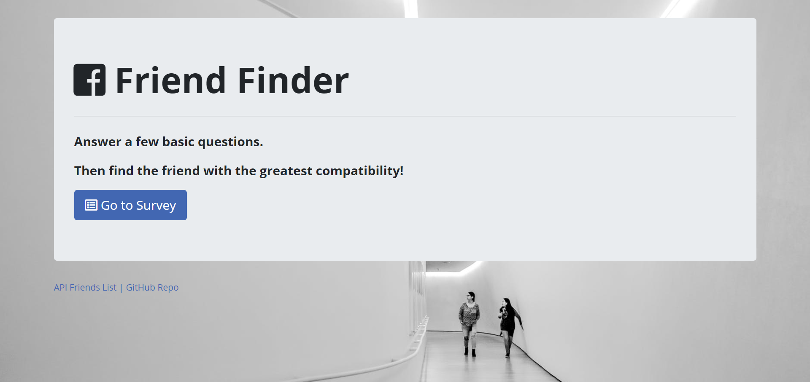
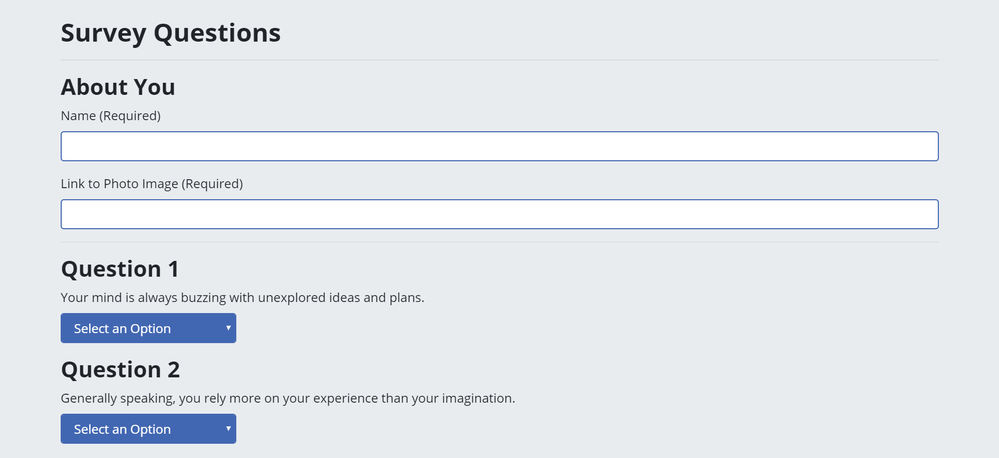
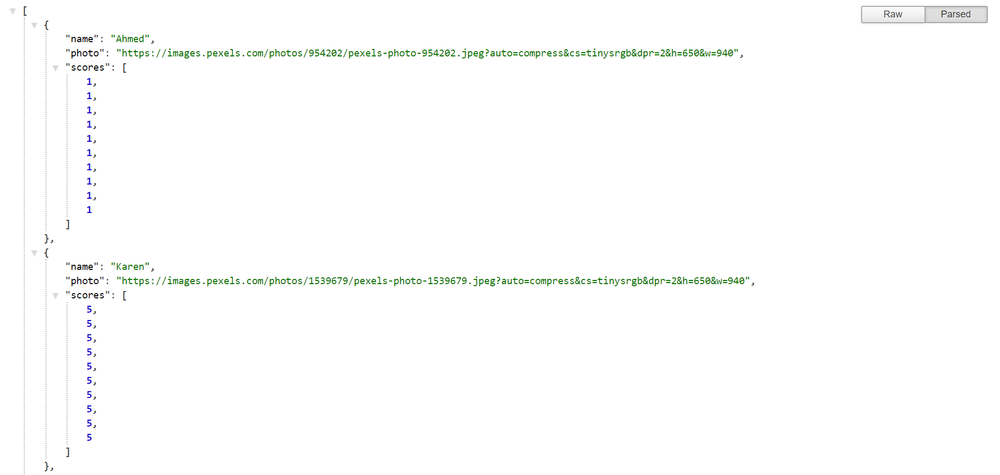

# FriendFinder

# Project Description

Friend Finder is a full-stack application meant to simulate a simple dating app. It takes in results from a user's response to questions and compares his or her answers with those from other users. The user responds to questions with values from 1 (Strongly Disagree) to 5 (Strongly Agree). After submitting the survey, Friend Finder will then display the name and picture of a user with the best overall match.

On the landing page, the user can click on the button to start the survey. The app also has links that take you to the raw API data or the GitHub repository for the project. Friend Finder uses Node.js and Express on the back-end and Bootstrap on the front-end for the design. The font used ('Open Sans') comes from Google Fonts. The icons used are from Font Awesome. The background image on the home page comes from https://www.pexels.com/.

# Technologies Used

* Express.js
* Node.js
* AJAX/APIs
* jQuery
* JavaScript
* Bootstrap
* CSS
* HTML

# Friend Finder Live Link

Friend Finder is deployed to Heroku. Please check it out here:

https://nameless-stream-53223.herokuapp.com/

# Screenshots

